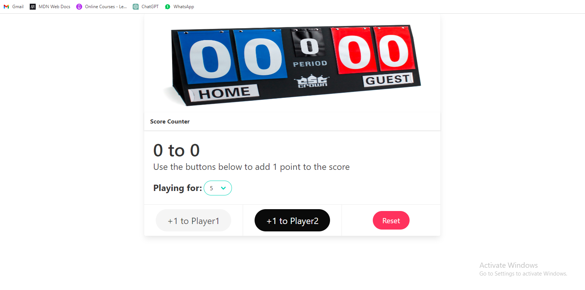
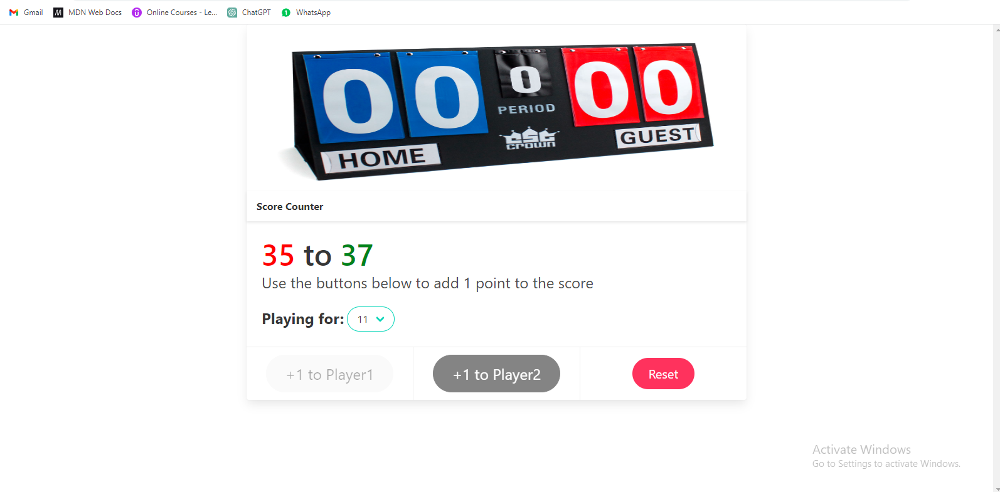
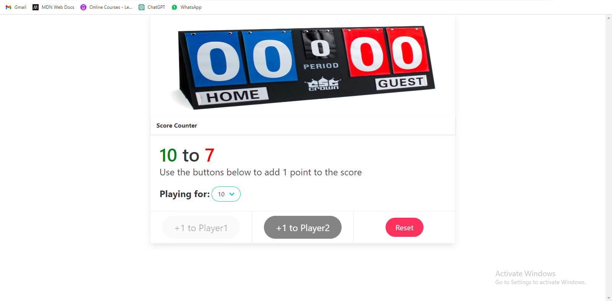
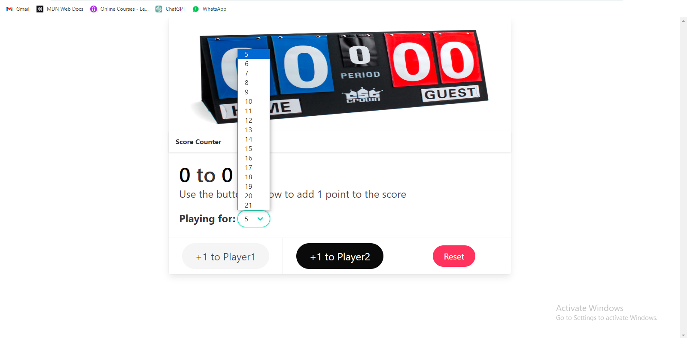

#Score Counter Web App

This is a simple web application for keeping track of scores between two players. It includes options to set the winning score and reset the game.

##Overview

This web application allows you to keep score for two players. It's perfect for games or activities where you need to track points. The key features include:

1.Two buttons for each player to increment their score.
2.The ability to set a winning score.
3.A reset button to start a new game.
4.Visual cues when a player wins (their score turns green, and the other player's score turns red).

##How to Use

1.Player 1 vs. Player 2: The two buttons labeled "Player 1" and "Player 2" allow you to increment the score for each player respectively. Click on the "Player 1" button to increase Player 1's score and the "Player 2" button to increase Player 2's score.

2.Winning Score: You can set the winning score by selecting a value from the dropdown labeled "Winning Score." The default winning score is 5, but you can change it to suit your needs.

3.Winning the Game: When a player's score reaches the winning score, the game ends. The winning player's score will turn green, and the other player's score will turn red. At this point, you can no longer increment the scores.

##Changing the Winning Score

You can change the winning score by following these steps:

1.Locate the "Winning Score" dropdown at the top of the page.

2.Click on the dropdown to reveal a list of possible winning scores.

3.Select the desired winning score from the list. The game will reset, and the scores will be set to zero.

##Resetting the Game

To start a new game or reset the scores, you can:

1.Click the "Reset Game" button located at the top of the page.
2.This will reset both players' scores to zero and allow you to continue playing with the currently selected winning score.